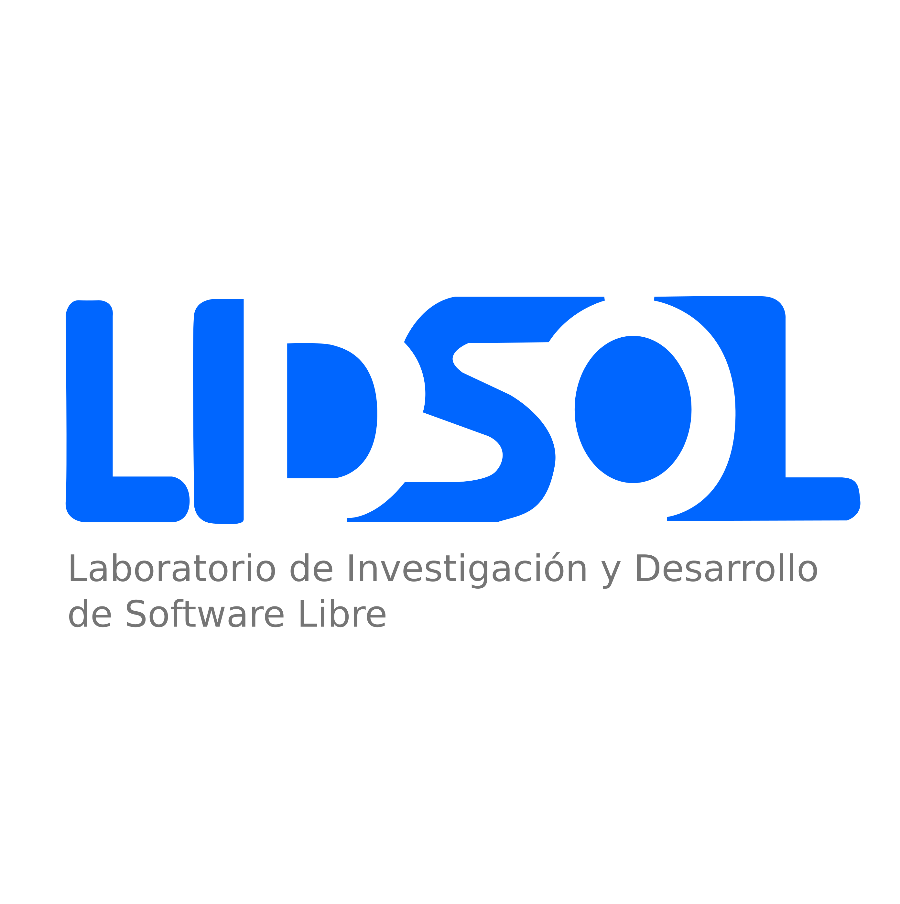
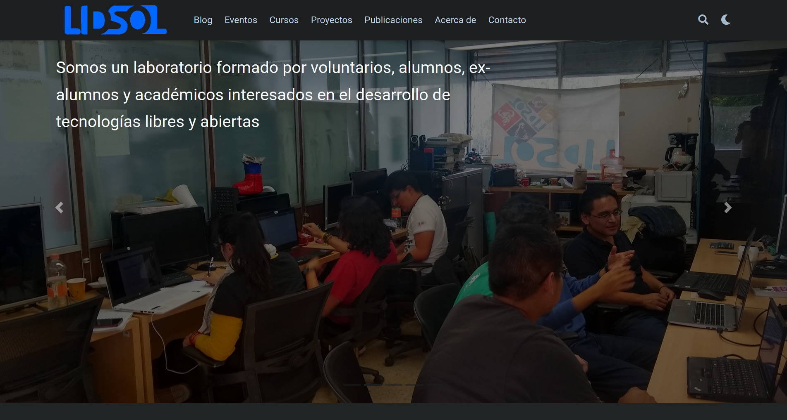
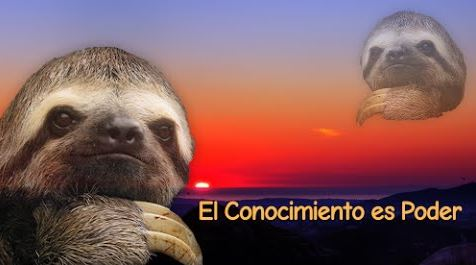
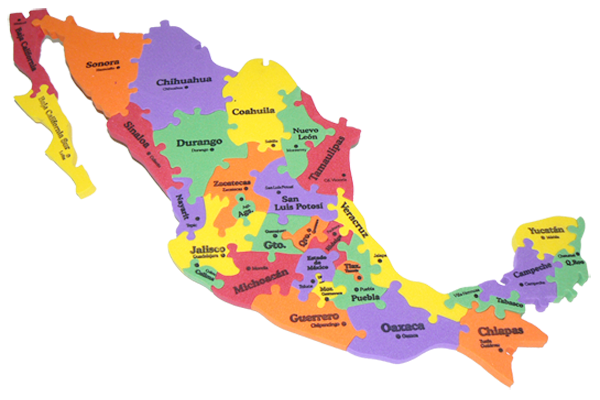
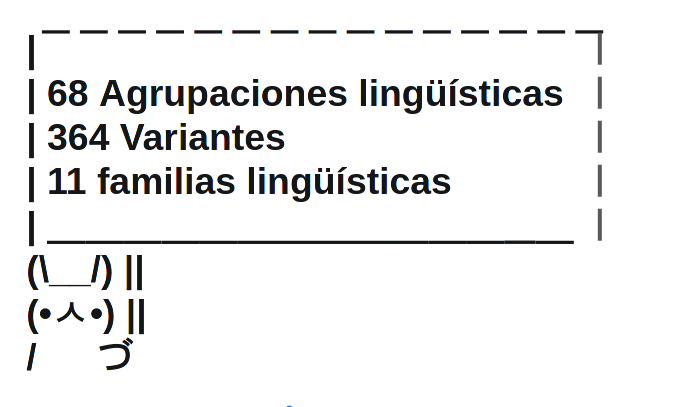
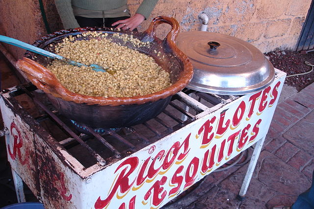
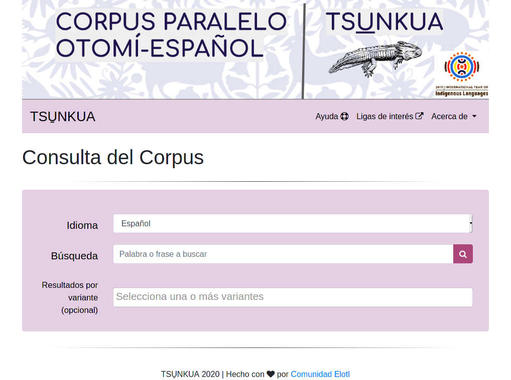
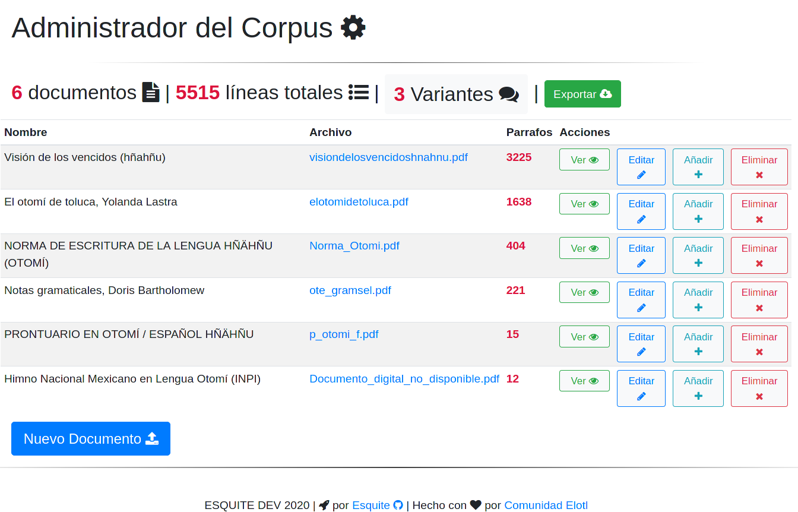
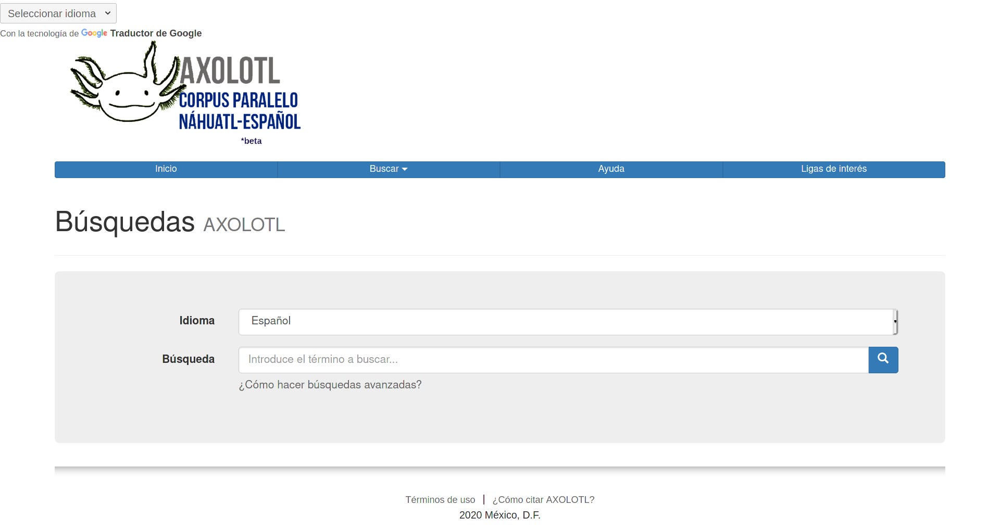
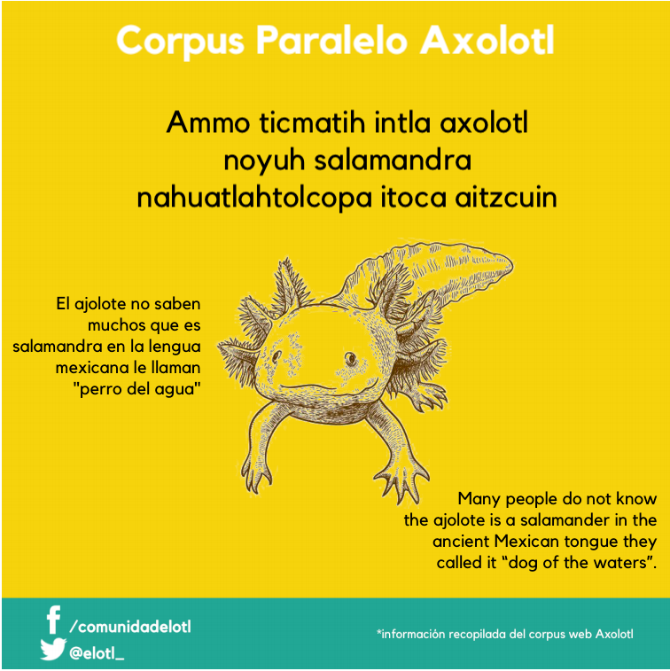

# `$ whoami`

{width=80%}

# Contenido

* LIDSOL
  * ¿Software Libre?
  * Libertades
* Comunidad Elotl
  * Diversidad lingüística
* Esquite
  * ¿Qué es?
  * ¿Qué hace?
  * ¿Cómo contribuir?
* Otros proyectos
  * Glosador
  * Axolotl
  * `import elotl`

# LIDSOL

{width=69%}

# ¿LIDSOL?



# ¿Con qué se come el software libre?

* El software libre es un movimiento social

. . .

* Miles de voluntarios creando software

. . . 

* Modelo de producción de conocimiento

. . .

* Esquema justo de licenciamiento

{width=40%}

# ¿De a cómo la libertad?

Para que un bicho sea considerado software libre debe cumplir 4 libertades que
se muestran a continuación:

* **Libertad de uso**
  * Podemos usarlo para lo que queramos
* **Libertad de aprendizaje**
  * Podemos aprender cómo es que está hecho y además tenemos acceso al código fuente
* **Libertad de modificación**
  * Podemos adecuar el programa a nuestras necesidades, corregir defectos, incorporar pedazos del programa a nuestros proyectos
* **Libertad de distribución**
  * Podemos compartir el programa con otras personas, tal como lo recibimos o con nuestras modificaciones

# ¿Pa' qué?

* El software es *conocimiento*
* El *conocimiento* es información (y poder)
* La información es **ciencia**

                    El software es ciencia

{width=250px}

# Desarrollos en México

{width=70%}

. . .

* ¿Cuántas lenguas se hablan en México?

. . . 

* ¿Hay un traductor para estas lenguas o una aplicación?

# Diversidad

{width=50%}

* La investigación y desarrollo para lenguas mexicanas no solo tiene un
  **impacto social** positivo

* También supone un **reto técnologico y 100tifiko** por las características de
  estas lenguas

# El gran problema

{width=50%}

* Casi no hay desarrollos tecnológicos para este tipo de lenguas
  * Son lenguas de escasos recursos digitales
  * Falta de interés o desconocimiento
  * Gran variedad dialectal y falta de normalización de las lenguas

# Comunidad Elotl

{height=80%}

# ¿Qué es Elotl?

* Grupo de voluntarias, becarias, académicas e interesadas en el desarrollo de
  **tecnologías del lenguaje** para lenguas habladas en México

. . .

* Herramientas **libres** y **gratuitas** <3

. . .

* **Difusión** de cuestiones lingüísticas, sociales y tecnológicas de lenguas
  mexicanas

. . . 

* Comunidad completamente virtual (desde antes de la plaga)


# Esquite

[](https://commons.wikimedia.org/w/index.php?curid=10889524)

# Ejemplo de implementación: TSUNKUA

[](https://tsunkua.elotl.mx)

# ¿Qué es Esquite?

* *Framework* para administrar corpus paralelos (textos bilingües) 

. . .

* Sistema web para hacer busquedas avanzadas por palabras o frases

. . .

* Administrador de documentos paralelos

. . .

* API para hacer busquedas de forma programática 


::::::::::::: {.columns}
:::{.column width=50%}


:::
:::{.column width=50%}


:::
::::::::::::::


# Administrador de corpus



# ¿Cómo puedo contribuir?


# ¿Te gusta programar?

* Con código, *features* y mejoras

. . .

* [Visita nuestro repositorio](https://github.com/ElotlMX/Esquite)
  * [CONTRIBUTING](https://github.com/ElotlMX/Esquite/blob/master/CONTRIBUTING.md)
  * [Docs](https://esquite.readthedocs.io/es/latest/index.html)

. . .

* ¿Aun tienes dudas de como mandar tus mejoras?
  * [Guias para contribuir](https://opensource.guide/how-to-contribute/#how-to-submit-a-contribution)
  * Contactanos :) 
    * contacto at elotl.mx
    * diegobarriga at protonmail.com
    * [\@elotlmx](https://twitter.com/elotlmx)

# No sabo programar ¿Cómo está el bisnes?

* Usa el *framework*

. . .

* Sugiere mejoras, características nuevas o cambios en la documentación

. . .

* Recopilación de textos bilingües
  * identificación
  * digitalización
  * procesamiento

. . .

* Difusión
  * Recomiendanos con quien mas confianza le tengas

. . .

* Investigación y desarrollo (NLP + *low resources*)
  * Integrantes de Elotl pueden dirigir tesis
  * En LIDSOL podrías liberar tu servicio social
  * Si eres profesxr podríamos ponerte en contacto con entusiastas del área

. . .

* Donaciones :p

# Otros proyectos de Elotl

## `import elotl`

```python
print("Name\t\tDescription")
list_of_corpus = elotl.corpus.list_of_corpus()
for row in list_of_corpus:
    print(row)
```

```
Name		Description
['axolotl', 'Is a Spanish-Nahuatl parallel corpus']
['tsunkua', 'Is a Spanish-otomí parallel corpus']
```

# Axolotl

[](https://www.axolotl-corpus.mx/)

# Materiales didácticos

[{height=90%}](https://elotl.mx/proyectos/materiales-didacticos/)

# gracias | jamadi | tlasohkamati

## Contacto

* diegobarriga at protonmail
* contacto at elotl.mx
* @elotl_
* elotl.mx
* github.com/ElotlMX

# Recursos

* [Elotl](http://www.elotl.mx/)
  * [Repo Esquite](https://github.com/ElotlMX/Esquite/)
  * [Repo modulo elotl](https://github.com/ElotlMX/py-elotl/)
  * [Tsunkua](https://tsunkua.elotl.mx/)
  * [Axolotl](https://axolotl-corpus.mx/search/)
  * [Materiales didácticos](https://elotl.mx/proyectos/materiales-didacticos/)
* [LIDSOL](http://lidsol.org/)
* [Guias de contribución](https://opensource.guide/)

---
title: "Desarrollo de Software Libre: Caso Esquite"
author: Diego A. Barriga (@umoqnier)
institute: Elotl / LIDSOL
theme: metropolis
colortheme: default 
date: "21 de Octubre 2020"
navigation: horizontal
---
